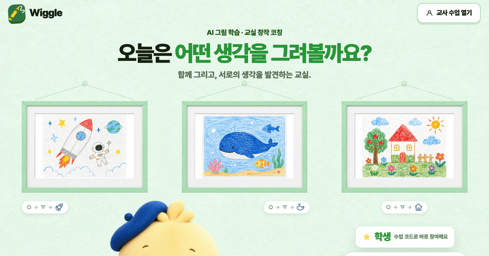

# 이제윤 · Lee JeYoun

**문제를 찾아서, 만들고, 출시하고, 사용자 이야기로 다시 고칩니다.**

백엔드 개발 1년 8개월 → 지금은 길고양이 기록 앱 **냥도감**을 혼자 만들어 운영합니다.

<i>My cat allows me to code. When my laptop is cold.</i> 🐈

 

## 🚀 만들고 있는 것

<table>
<tr>
<td width="50%" valign="top">

### 냥도감

**길고양이를 사진 한 장으로 기록하는 도감 앱** 
1인 창업 · 2026.05 ~ 현재 · React Native(Expo) · Supabase

- 첫 커밋부터 **4개월 만에 양대 스토어 출시**
- 출시 뒤 일주일 동안 피드백으로 **업데이트 3번**
- 출시 한 달, **가입자 83명** (2026.10.08 기준)

[소개 페이지](https://catdex.muppin.org) · [Instagram](https://www.instagram.com/nangdogam)

</td>
<td width="50%" valign="top">

### Wiggle

**초등 교실용 AI 그림 코칭 웹앱** 
4인 팀 · 제품 결정 · 프론트엔드 · 2026.06 ~ 현재 · Next.js

- **초등학교 수업에서 직접 테스트**하고 고침
- 아이들이 버튼을 안 눌러, **AI가 먼저 말을 걸게** 변경
- 2026 경기청년 갭이어 팀 선정

[www.kkumtle.app](https://www.kkumtle.app)

</td>
</tr>
</table>

<b>냥도감에서 풀어 본 문제들</b>

 

| 들은 말 · 마주친 문제 | 한 일 |
|---|---|
| "등록이 느려요" | 직접 재 보니 서버(평균 100ms)가 아니라 3~5MB 사진 업로드가 병목. 압축해서 해결 |
| "죽은 앱 같아요" | 운영 데이터를 열어 보니 등록된 고양이가 5마리. 지도를 '쌓인 활동'을 보여 주는 판으로 다시 설계 |
| 지자체 제안에 답이 없음 | 보여 줄 데이터가 없어서라고 판단. 중성화 여부를 사진으로 가려내는 모델을 실험 |
| 공개 모델이 내 사진 17장 중 1장만 맞힘 | 사진 301장을 직접 분류해 다시 학습(교차검증 74%). 실제 사진에서는 부족해 앱에는 넣지 않음 |

<b>Wiggle에서 풀어 본 문제들</b>

 

| 들은 말 · 마주친 문제 | 한 일 |
|---|---|
| "보안상 6자리 코드" vs "아이들은 긴 코드를 못 쳐요" | 반 QR로 반을 먼저 정하고 4자리만 입력. 두 의견을 모두 지킴 |
| "도화지가 너무 작아요" | 축소하면 화면 3장 너비까지 확장. 예전 작품은 그대로 열리게 유지 |
| "펜보다 선이 늦게 따라와요" | 그리는 중인 선을 얇은 층에 따로 그려 지연 제거 |
| "집을 그렸는데 다른 걸로 추측해요" | AI에 보내는 그림이 너무 작게 줄어든 것과 지시문, 원인 2개를 찾아 수정 |

 

## 💼 경력

**㈜날리지포인트** · 시스템본부 주임 · 2025.06 ~ 2026.07 
KT 스팸 차단 서비스(누적 가입자 2,500만 명) 서버 개발 · 운영

- 배치 프로그램 33개를 Solaris/C에서 **Azure/Java 17로 전환**
- GitHub Actions + Jenkins로 **33개 모듈 배포 자동화**
- 서버 4대가 같은 메시지를 **중복 발송하던 문제 해결**

**㈜제이케이코어** · 웹연구개발부서 인턴 · 2023.07 ~ 2023.12 
태양광 발전 모니터링 앱 '오늘해' 서버 개발

- 발전량 · 수익금 REST API, 로그인(Spring Security + JWT, OAuth2)
- Jenkins + Nginx로 **무중단 배포** 구성

 

## 🛠 기술

AI 도구: Claude Code · Codex · 프롬프트 설계

 

## 🎓 학력 · 자격

- 한국기술교육대학교 컴퓨터공학 졸업 (편입, 2021.03 ~ 2025.09)
- 정보처리기사 (2024.06) · 리눅스마스터 2급 (2025.07)
- 2026 모두의 창업 1라운드 합격 (냥도감)
